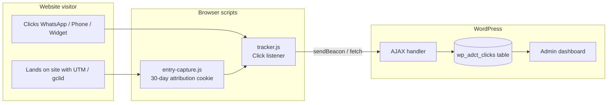
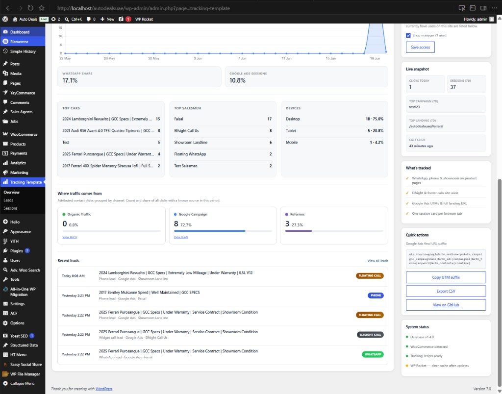
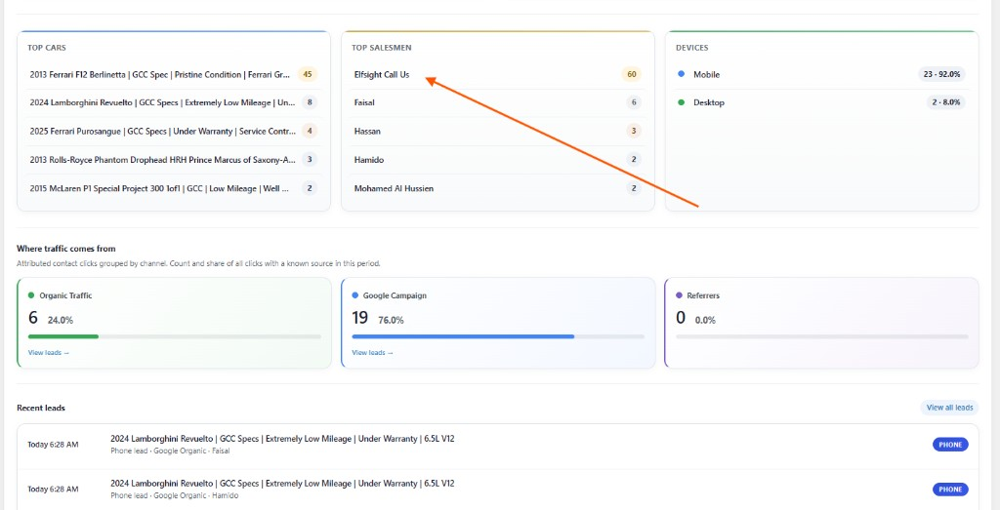

# Tracking Template — Project Report

**WordPress contact-click tracking with marketing attribution and sales reporting**

| | |
|---|---|
| **Project name** | Tracking Template |
| **Author** | Benjamin Clar |
| **Current version** | 1.4.3 |
| **Repository** | [github.com/benjamindimalanta/tracking-template](https://github.com/benjamindimalanta/tracking-template) |
| **First live site** | [autodealsuae.com](https://autodealsuae.com) |
| **Report date** | June 2026 |

---

## Executive summary

**Tracking Template** is a custom WordPress plugin built to answer a simple but critical business question for car dealerships:

> *When someone is interested in a car, how did they contact us, which car were they looking at, which salesman did they reach, and where did that visitor come from?*

Before this project, contact clicks (WhatsApp, phone, showroom numbers, floating buttons, and third-party call widgets) were invisible. Marketing spend on Google Ads could not be tied to real enquiry intent on specific vehicles. Sales managers had no central record of which products and agents were generating the most contact activity.

Tracking Template closes that gap. It records every contact click, attaches marketing attribution (Google Ads, organic search, referrals), groups activity into visitor sessions, and presents everything in a clean WordPress admin dashboard — **Overview**, **Leads**, and **Sessions** — with charts, filters, and CSV export.

The plugin is designed as a **reusable template**: it can be installed on other WordPress / WooCommerce dealership sites with minimal theme integration.

---

## 1. The business problem

Auto Deals UAE (and similar dealership sites) rely on high-intent contact actions:

- WhatsApp messages from product pages  
- Mobile number clicks assigned to individual sales agents  
- Showroom landline and footer phone calls  
- Site-wide Elfsight “Call Us” widgets  
- Floating WhatsApp / phone buttons  

These actions represent **leads** — not page views, but genuine purchase intent.

### What was missing

| Gap | Impact |
|---|---|
| No per-product click counts | Could not see which cars generate the most enquiries |
| No per-salesman breakdown | Could not measure agent button performance |
| No marketing source link | Google Ads ROI was disconnected from contact clicks |
| No session context | Multiple clicks from one visit were scattered |
| No admin reporting | Data lived only in analytics tools (if at all), not in WordPress |

### Example use case (original requirement)

For a product like `autodealsuae.com/cars/e05119-jetour-t2-luxury-traveler/`:

```
Title: 2024 Jetour T2 Luxury Traveler

Faisal mobile click     = 4
Faisal WhatsApp click   = 1
Hassan WhatsApp click   = 2
Showroom tel click      = 2
```

The plugin records exactly this — per product, per agent, per contact type — and surfaces it in the admin.

---

## 2. Solution overview

Tracking Template is a **first-party WordPress plugin**. All data is stored in the site’s own database. No external spreadsheet, no third-party SaaS dependency, no per-click fees.

### Core capabilities

1. **Click capture** — JavaScript listens for contact button clicks site-wide  
2. **Attribution** — 30-day first-touch cookie stores UTM parameters, `gclid`, landing page, and referrer  
3. **Session grouping** — Each browser tab gets a session ID; related clicks stay together  
4. **Product enrichment** — On WooCommerce product pages, car title, price, mileage, and image are saved with each click  
5. **Admin reporting** — Visual dashboards, filterable tables, CSV export  
6. **Role-based access** — Shop managers and other roles can be granted view access  
7. **One-click updates** — Plugin checks GitHub Releases and updates from the WordPress admin  

---

## 3. How it works

### Data flow



### What gets recorded on each click

| Field | Example |
|---|---|
| Product title | 2024 Lamborghini Revuelto |
| Product URL | `/cars/lamborghini-revuelto/` |
| Price / mileage | AED 1,850,000 · 5,000 km |
| Salesman | Faisal |
| Contact type | WhatsApp, Phone, Elfsight Call, etc. |
| Entry source | Google Ads, Google Organic, Direct, Referral |
| Campaign | `{campaignname}` from UTM |
| Landing page | First page visited in 30 days |
| Device | Mobile, Desktop, Tablet |
| Browser / country | Chrome · UAE |
| Session ID | Groups clicks from same visit |

### Attribution model (first-touch, 30 days)

When a visitor arrives with Google Ads UTMs or `gclid`, that source is stored in a cookie (`adct_attribution`) for **30 days**. If they browse multiple cars and click contact days later, the **original marketing source** is still credited.

This matches how dealerships think about marketing: *“This lead came from Google Ads campaign X, even if they looked at three cars before calling.”*

---

## 4. Admin dashboard

The plugin adds a **Tracking Template** menu in WordPress with three pages:

```
Tracking Template
├── Overview      ← Visual summary (default landing page)
├── Leads         ← One row per contact click (sales-focused)
└── Sessions      ← Grouped by visitor session (investigation view)
```

A **sidebar panel** on every page shows live stats, tracked features, Google Ads UTM copy button, CSV export, and system status.

---

## 5. Screenshots & feature walkthrough

### 5.1 Overview — insight panels and traffic channels

The **Click performance** tab shows trends plus actionable insight panels:



**What you see:**

| Panel | Purpose |
|---|---|
| **Top cars** | Which vehicles get the most contact clicks |
| **Top salesmen** | Which sales agents’ buttons perform best (widget labels excluded) |
| **Devices** | Mobile vs desktop vs tablet split |
| **Where traffic comes from** | Organic · Google Campaign · Referrers with count and % |
| **Recent leads** | Last 5 enquiries with quick link to full Leads page |

**Why it matters:** A sales manager can open Overview each morning and immediately see which inventory and agents are hot, and whether Google Ads or organic search is driving enquiries.

---

### 5.2 Overview — traffic attribution and live sidebar



**Traffic channels explained:**

| Channel | Includes |
|---|---|
| **Organic Traffic** | Visitors from Google organic search |
| **Google Campaign** | Google Ads clicks (`google_cpc`, `gclid`) |
| **Referrers** | Direct, referral sites, social, and other sources |

**Right sidebar highlights:**

- **Live snapshot** — clicks today, 7-day sessions, top campaign, last click time  
- **What’s tracked** — checklist of active tracking features  
- **Quick actions** — copy Google Ads UTM suffix, export CSV, GitHub link  
- **System status** — plugin version, database version, WooCommerce detection  

---

### 5.3 Overview — charts (summary section)

Above the insight panels, Overview also includes:

- **Clicks summary donut** — breakdown by contact type (WhatsApp, Phone, Floating Call, Elfsight, etc.)  
- **Daily trend chart** — contact clicks and visitor sessions over time  
- **WhatsApp share / Google Ads sessions** — quick KPI tiles  
- **Marketing tab** — traffic sources chart, top campaigns, top landing pages  

Period selector: **Last 7 / 30 / 90 days**.

---

### 5.4 Leads page

Designed like a CRM-style lead list (similar in spirit to Dubizzle lead management):

| Column | Content |
|---|---|
| Date | Today 8:08 AM, Yesterday, etc. |
| Status | WhatsApp lead, Phone lead, Widget call lead |
| Enquiry about | Car photo, title, price, link to product page |
| Source | Google Ads, Google Organic, etc. + landing path |
| Campaign | UTM campaign name |
| Salesman | Agent name (— for widget/site-wide clicks) |

**Tabs:** All · Phone · WhatsApp — each with live counts.

Filters: date range, salesman, contact type, source, search. **CSV export** for spreadsheets.

---

### 5.5 Sessions page

For deeper investigation. Each **session card** represents one browser visit:

- Expand to see marketing data (source, campaign, landing page, device, country)  
- All clicks inside that session in chronological order  
- Color-coded left border by traffic source (blue = Google Ads, green = organic, etc.)  

Best for answering: *“What did this visitor do before they clicked WhatsApp?”*

---

## 6. What gets tracked automatically

### Product page buttons (theme integration)

Theme contact links use `data-track="contact"` attributes:

```html
<a href="https://wa.me/971..."
   data-track="contact"
   data-contact-type="whatsapp"
   data-agent-id="1"
   data-agent-name="Faisal"
   data-source="product_card">
   WhatsApp
</a>
```

### Automatic detection (no theme changes needed)

| Source | Contact type |
|---|---|
| Elfsight “Call Us” widget | `elfsight_call` |
| Footer `tel:` links | `footer_landline` |
| Floating site-wide buttons | `floating_whatsapp`, `floating_phone` |

### Google Ads integration

Recommended final URL suffix (built into sidebar copy button):

```
utm_source=google&utm_medium=cpc&utm_campaign={campaignname}&utm_id={campaignid}&utm_term={keyword}&utm_content={creative}
```

---

## 7. Why this project is valuable

### For the business owner

- **See real leads, not just traffic** — contact clicks are closer to revenue than page views  
- **Know which cars to promote** — top cars panel shows demand  
- **Measure marketing ROI** — tie Google Ads spend to actual enquiry clicks  
- **Hold sales team accountable** — per-agent click performance (real agents only, not widgets)  
- **All inside WordPress** — no separate login or monthly analytics subscription  

### For marketing

- Campaign-level reporting without Google Analytics complexity  
- Landing page performance — which entry pages convert to contact clicks  
- Channel split: organic vs paid vs referral  
- Export to CSV for monthly reports  

### For developers / agencies

- **Reusable template** — install on any dealership WordPress site  
- **GitHub Releases** — versioned updates pushed to live sites from admin  
- **WP Rocket compatible** — scripts excluded from defer/delay/minify  
- **Role-based access** — safe to give Shop Manager read-only dashboard access  
- **GPL licensed** — fork and extend freely  

### Compared to alternatives

| Approach | Limitation | Tracking Template |
|---|---|---|
| Google Analytics events | Hard to tie to specific car + salesman; not in WP admin | Native per-product, per-agent records |
| Google Sheets / Apps Script | External dependency, token issues, not real-time in WP | First-party database, instant admin view |
| Dubizzle / marketplace leads | Only marketplace enquiries | Own website + all contact channels |
| WooCommerce orders | Orders ≠ contact intent | Captures intent before purchase |

---

## 8. Technical summary

### Requirements

- WordPress 5.8+  
- PHP 7.4+  
- WooCommerce (optional, for product enrichment)  

### Database

Custom table: `{prefix}_adct_clicks` — created automatically on plugin activation. All historical data is preserved across plugin updates.

### Key files

```
tracking-template/
├── tracking-template.php           # Bootstrap, script enqueue, WP Rocket exclusions
├── assets/
│   ├── entry-capture.js            # Attribution cookie + session ID
│   ├── tracker.js                  # Click capture (product, Elfsight, footer)
│   ├── overview.js                 # Chart.js dashboard interactions
│   └── chart.umd.min.js
└── includes/
    ├── class-adct-admin.php        # Overview, Leads, Sessions UI
    ├── class-adct-analytics.php    # Aggregations, traffic channels, top lists
    ├── class-adct-leads.php        # Lead labels, channel tabs, salesman logic
    ├── class-adct-database.php     # Queries, filters, CSV data
    ├── class-adct-settings.php     # Role-based access control
    ├── class-adct-updater.php      # GitHub Releases one-click update
    ├── class-adct-ajax.php         # Front-end click logging endpoint
    └── class-adct-visitor.php      # Device, browser, geo detection
```

### Performance & reliability

- Clicks sent via `navigator.sendBeacon` (non-blocking, survives page navigation)  
- 2-second debounce prevents duplicate counts from double-clicks  
- Tracking scripts never block the user’s WhatsApp or phone action  
- Fail-silent design — if logging fails, the contact link still works  

---

## 9. Project timeline & version history

The plugin evolved from a basic click logger into a full analytics dashboard:

| Version | Milestone |
|---|---|
| **1.0.0** | Initial release — session grouping, attribution, Elfsight/footer tracking |
| **1.1.0** | Admin sidebar, live snapshot, UTM copy button |
| **1.2.0** | Role-based access control, GitHub one-click updates |
| **1.3.0** | Overview page with charts and period selector |
| **1.3.2** | Marketing tab — sources, campaigns, landing pages |
| **1.4.0** | Leads page with All / Phone / WhatsApp tabs and CSV export |
| **1.4.1** | Access control fix — Shop manager role persists after save |
| **1.4.2** | Overview insight panels, traffic channel breakdown, UI polish |
| **1.4.3** | Top salesmen fix — excludes Elfsight/widget labels from agent ranking |

**GitHub releases:** [github.com/benjamindimalanta/tracking-template/releases](https://github.com/benjamindimalanta/tracking-template/releases)

---

## 10. Deployment — Auto Deals UAE

| Environment | URL | Purpose |
|---|---|---|
| **Production** | autodealsuae.com | Live dealership site |
| **Local dev** | localhost/autodealsuae | Testing with XAMPP |

### Live update process

1. Open **Tracking Template** in WordPress admin  
2. Sidebar → **Check for updates**  
3. Update to latest version (currently **1.4.3**)  
4. Clear **WP Rocket** cache  
5. Verify Overview and Leads pages load correctly  

---

## 11. Suggested additional screenshots

For an even more complete report deck, capture these from the live or local admin and save them to `docs/screenshots/`:

| Filename | What to capture |
|---|---|
| `overview-summary-donut.png` | Top of Overview — contact type donut + legend |
| `overview-marketing-tab.png` | Marketing tab — sources and campaigns charts |
| `leads-page.png` | Full Leads table with tabs |
| `sessions-page.png` | Expanded session card showing click timeline |
| `access-control.png` | Shop manager checkbox in sidebar (admin only) |

Then add them to this document with:

```markdown

```

---

## 12. Conclusion

Tracking Template transforms a WordPress car dealership site from a static brochure into a **measurable sales channel**. Every WhatsApp tap, phone click, and widget call becomes structured data tied to products, salespeople, and marketing campaigns.

For Auto Deals UAE, this means:

- Clear visibility into which cars and agents drive enquiries  
- Honest attribution for Google Ads and organic search  
- A daily dashboard the team can actually use — without leaving WordPress  
- A maintainable, updatable plugin foundation for future sites  

The project demonstrates that custom first-party tracking — built for how dealerships actually sell — delivers more actionable insight than generic analytics alone.

---

## Appendix

### A. Contact types tracked

| Type | Label | Typical source |
|---|---|---|
| `whatsapp` | WhatsApp | Product page agent button |
| `phone` | Phone | Product page mobile number |
| `showroom_landline` | Showroom | Product page landline |
| `floating_whatsapp` | Floating WhatsApp | Site-wide floating button |
| `floating_phone` | Floating Call | Site-wide floating button |
| `elfsight_call` | Elfsight Call | Elfsight widget |
| `footer_landline` | Footer Phone | Footer tel: link |

### B. Entry sources (attribution)

| Source key | Meaning |
|---|---|
| `google_cpc` | Google Ads (gclid or utm_medium=cpc) |
| `google_organic` | Google search (organic referrer) |
| `direct` | Typed URL or no referrer |
| `referral` | External website |
| `youtube`, `facebook`, etc. | Named referrers |

### C. Links

- **Plugin repository:** https://github.com/benjamindimalanta/tracking-template  
- **Latest release:** https://github.com/benjamindimalanta/tracking-template/releases/latest  
- **Author:** https://github.com/benjamindimalanta  

---

*Report prepared for the Tracking Template project — Benjamin Clar, June 2026.*
